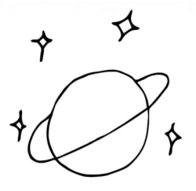
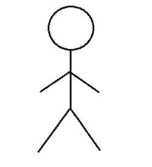

> Concept being taught: Use the right tool for the job.

# Beyond the DOM

So far in this course, every time you've written some line of code, to make something appear in the browser window, you have been using an interface known as the Document Object Model (the DOM).

However, the DOM isn't the only way available to you, as a developer, to get the browser to show things on-screen.

The DOM has some advantages:

> Author's Note: List them.

Assume that you're a carpenter, and you need to make a chair. If you need to put a nail into a wall, you might reach for your hammer. On the other hand, if you needed to make a rough piece of wood smooth... **[ INCOMPLETE ]**

> Author's Note: Rewrite the above para.

Think of the DOM as one of the tools in your box of tools. It's great at a lot of tasks, because of which you're going to find yourself reaching for, and using the DOM most of the time.

But not _always_.

There are some situations where using the DOM would make your job much harder than it needs to be - some tasks that you might want to do where the DOM, as a tool, falls short. Besides the DOM, there are three other tools available to you for _drawing_ things on the browser:

1. Canvas
2. Scalable Vector Graphics **[ RESEARCH: Is this a part of the DOM? ]**
3. WebGL

> Author's Note: Explain when to use SVG. Then explain when WebGL makes sense.

## Why use a canvas?

Using the HTML `<canvas>` you can set aside a portion of the browser's window where you can freely draw whatever it is that you want to draw. Just like a real, physical canvas, an HTML `<canvas>` is rectangular, and will have some boundaries. Drawing on a `<canvas>` usually involves _moving_ to a point on the canvas and then performing an action at a point - something like drawing a line, a box, a circle, or maybe a curve.

Creating a full drawing usually involves a series of steps.

To finish this lesson, let's try drawing something simple.

> Author's Note: Demo drawing a smiley, which is simple, or...

> Author's Note: ...demo drawing a planet on a background of stars, or...

> Author's Note: ...draw a stick figure.

