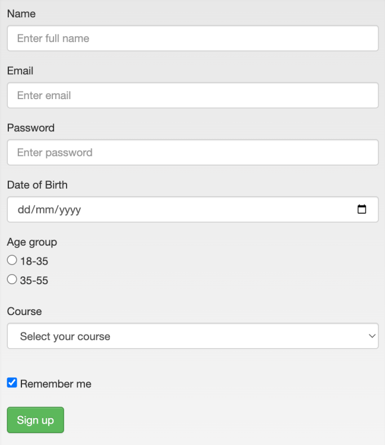

# Text

In this lesson we will create our first form using the HTML `form` element.

## Prerequisites

1. Understanding of Basic HTML
2. Understanding of CSS
3. Understanding of HTTP basics

## Design



## Script

First, let us create a `form` element as a wrapper for all the controls we build for this HTML Form.

> Action: Open editor and create a form element as below

```js
<form>
    #form controls
</form>
```

Next, let us create the controls one by one. We will start with the Name input field. It is a text only input field so we will create a input element of type set to text. We will also create a `label` for all the input elements as per the design.

```js
<form>
    <label for="name">Name</label>
    <input type="text" id="name" name="name">
</form>

```

Next, we will create the email input field. It is a email only input field so we will create a input element of type set to email.

```js
<form>
    <label for="name">Name</label>
    <input type="text" id="name" name="name">

    <label for="email">Email</label>
    <input type="email" id="email" name="email">
</form>

```

Next, we will create the password input field. It is a password only input field so we will create a input element of type set to password.

```js
<form>
    <label for="name">Name</label>
    <input type="text" id="name" name="name">
    
    <label for="email">Email</label>
    <input type="email" id="email" name="email">

    <label for="password">Password</label>
    <input type="password" id="password" name="password">
</form>

```

Next, we will create the Date of Birth input field. It is a input field which gives you the ability to pick a date using the date picker. We will use the input type as date for this control.

```js
<form>
    <label for="name">Name</label>
    <input type="text" id="name" name="name">
    
    <label for="email">Email</label>
    <input type="email" id="email" name="email">

    <label for="password">Password</label>
    <input type="password" id="password" name="password">

    <label for="dob">Date of Birth</label>
    <input type="date" id="dob" name="dob">
</form>

```

Next, we will create a radio button group. This radio button control is used to select only one of the given values and is grouped by the `name` attribute.

```js
<form>
    <label for="name">Name</label>
    <input type="text" id="name" name="name">
    
    <label for="email">Email</label>
    <input type="email" id="email" name="email">

    <label for="password">Password</label>
    <input type="password" id="password" name="password">

    <label for="dob">Date of Birth</label>
    <input type="date" id="dob" name="dob">

    <p>Age group</p>
    <input type="radio" id="agegroup1" name="agegroup" value="18plus">
    <label for="agegroup1">18-35</label>
    
    <input type="radio" id="agegroup2" name="agegroup" value="35plus">
    <label for="agegroup2">36-55</label>
</form>

```

